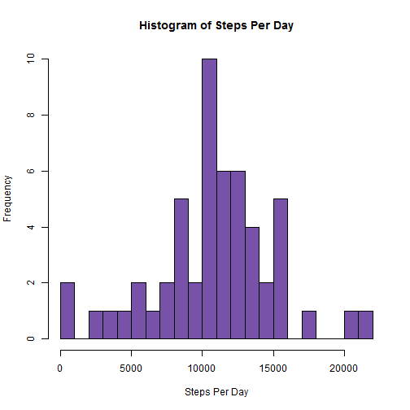
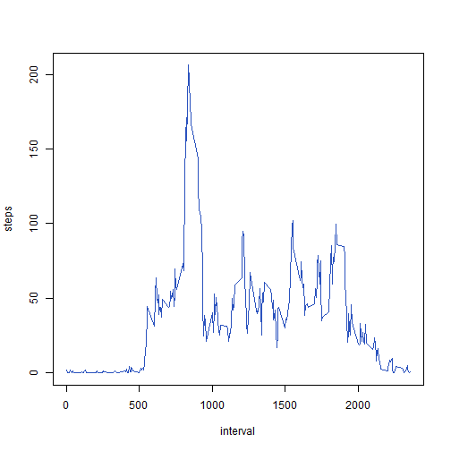
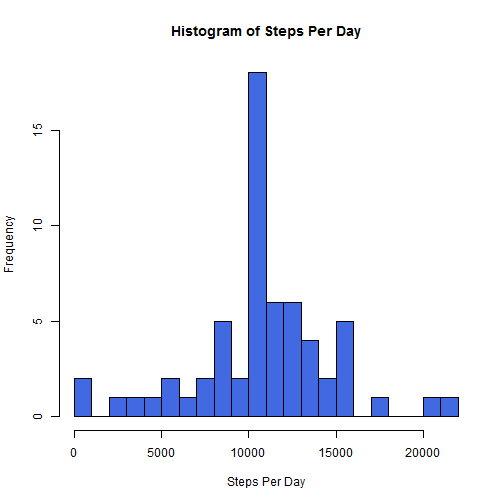
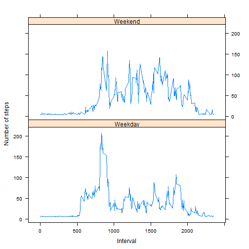

## Loading and preprocessing the data

Load the data (i.e. read.csv())


```r
unzip("activity.zip")
activityCSV<-read.csv("activity.csv")
```

Process/transform the data (if necessary) into a format suitable for your analysis


```r
library(data.table)
activityDT<-data.table(activityCSV)
```

## What is mean total number of steps taken per day?

Make a histogram of the total number of steps taken each day


```r
stepsSUM<-aggregate(steps ~ date, data=activityDT, sum)
hist(stepsSUM$steps, breaks=20, col="#7851a9", border="black", main="Histogram of Steps Per Day", xlab="Steps Per Day", ylab="Frequency")
```

 

Calculate and report the mean and median total number of steps taken per day


```r
stepsMEAN<-mean(stepsSUM$steps)
stepsMEAN
```

```
## [1] 10766.19
```

```r
stepsMEDIAN<-median(stepsSUM$steps)
stepsMEDIAN
```

```
## [1] 10765
```

## What is the average daily activity pattern?

Make a time series plot (i.e. type = "l") of the 5-minute interval (x-axis) and the average number of steps taken, averaged across all days (y-axis)


```r
stepsINTERVAL<-aggregate(steps ~ interval, data=activityDT, FUN=mean)
plot(stepsINTERVAL, type="l", col="#2a52be")
```

 

Which 5-minute interval, on average across all the days in the dataset, contains the maximum number of steps?


```r
stepsORDER <- stepsINTERVAL[order(stepsINTERVAL$steps, decreasing=TRUE), ]
stepsORDER[1,]
```

```
##     interval    steps
## 104      835 206.1698
```

## Imputing missing values

Calculate and report the total number of missing values in the dataset (i.e. the total number of rows with NAs)


```r
missingSUM<-sum(is.na(activityDT))
missingSUM
```

```
## [1] 2304
```

Devise a strategy for filling in all of the missing values in the dataset. The strategy does not need to be sophisticated. For example, you could use the mean/median for that day, or the mean for that 5-minute interval, etc.

* I have chosen to replace missing observations with the overall mean of steps taken.


```r
stepsVECTOR<-activityDT$steps
strategyNA<-mean(stepsVECTOR, na.rm=TRUE)
```

Create a new dataset that is equal to the original dataset but with the missing data filled in.


```r
new_activityDT<-activityDT
new_activityDT$steps[is.na(new_activityDT$steps)]<-mean(new_activityDT$steps, na.rm = TRUE)
```

Make a histogram of the total number of steps taken each day and Calculate and report the mean and median total number of steps taken per day.


```r
new_stepsSUM<-aggregate(steps ~ date, data=new_activityDT, sum)
hist(new_stepsSUM$steps, breaks=20, col="#4169E1", border="black", main="Histogram of Steps Per Day", xlab="Steps Per Day", ylab="Frequency")
```

 

```r
new_stepsMEAN<-mean(new_stepsSUM$steps)
new_stepsMEAN
```

```
## [1] 10766.19
```

```r
new_stepsMEDIAN<-median(new_stepsSUM$steps)
new_stepsMEDIAN
```

```
## [1] 10766.19
```

Do these values differ from the estimates from the first part of the assignment? 

* The median has increased by 1.19.

What is the impact of imputing missing data on the estimates of the total daily number of steps?

* The new mean and median are now identical to the original mean.

## Are there differences in activity patterns between weekdays and weekends?

Create a new factor variable in the dataset with two levels – “weekday” and “weekend” indicating whether a given date is a weekday or weekend day.


```r
new_activityDT$day<-weekdays(as.Date(new_activityDT$date))
new_activityDT$day_type<-ifelse(new_activityDT$day=="Saturday" | new_activityDT$day=="Sunday", "Weekend", "Weekday")
```

Make a panel plot containing a time series plot (i.e. type = "l") of the 5-minute interval (x-axis) and the average number of steps taken, averaged across all weekday days or weekend days (y-axis).


```r
daystepsMEAN<-aggregate(new_activityDT$steps, by=list(new_activityDT$interval, new_activityDT$day_type), mean)
names(daystepsMEAN)<-c("interval", "day_type", "steps")
library(lattice) 
xyplot(steps ~ interval | day_type, daystepsMEAN, type="l", layout=c(1,2), xlab="Interval", ylab="Number of steps")
```

 


